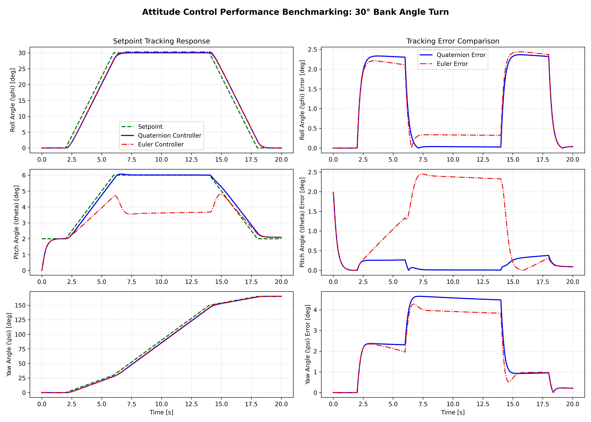
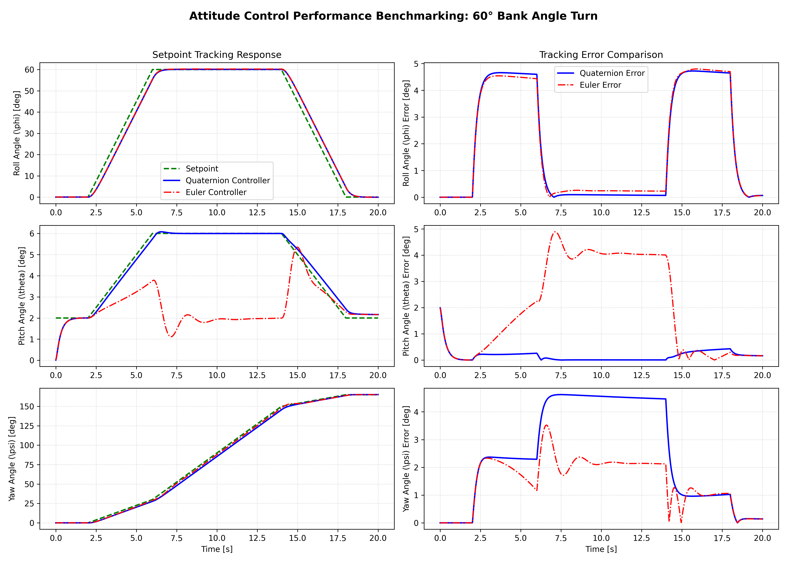
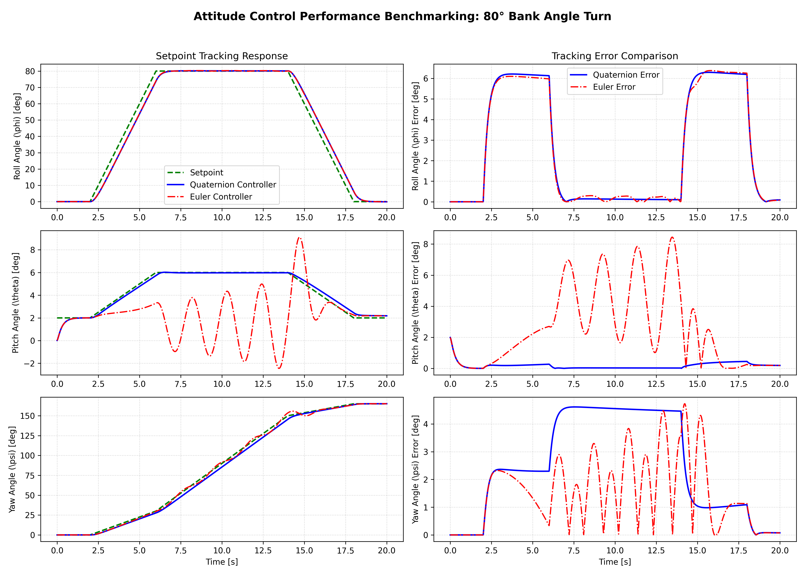
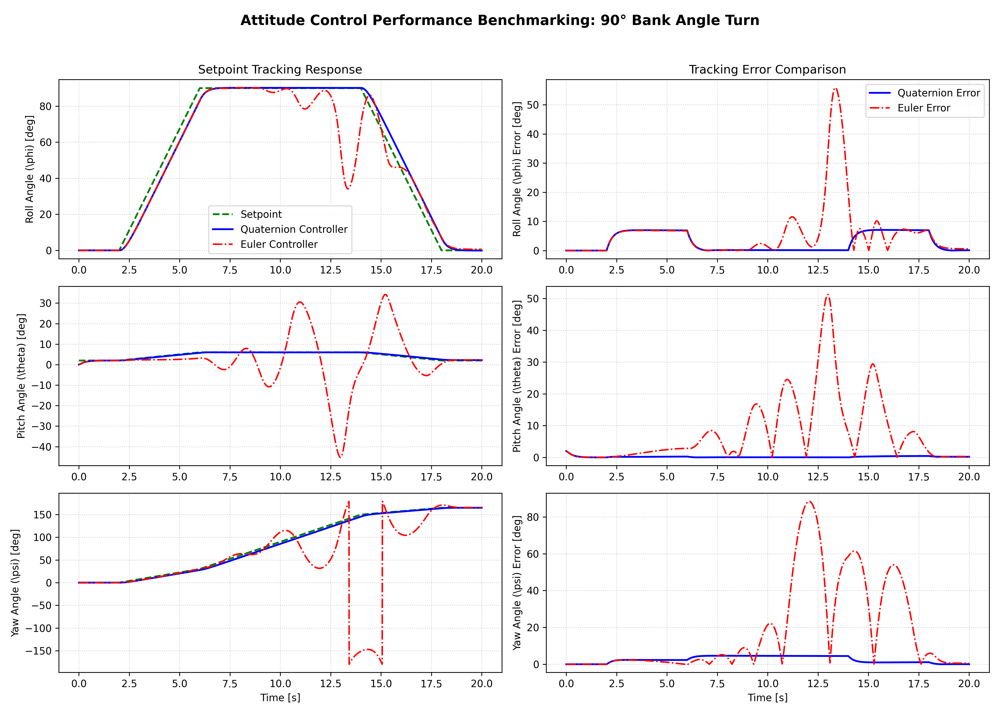
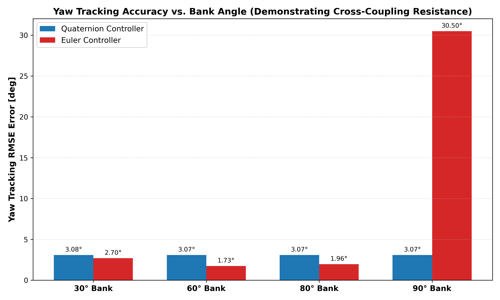

  

# Project Report: Quaternion Attitude Control System of Highly Maneuverable Aircraft

**Course:** 21AER314 / Drone Technologies & Flight Control  
**Department:** Aerospace Engineering  
**Institution:** Amrita School of Engineering, Amrita Vishwa Vidyapeetham  
**Repository Name:** `Drones_S5_CD13_Quaternion_Attitude_Control_UAV`  
**Group Number:** 13 (Section C/D)  
**Review Target:** First Project Review (SITL Simulation & Math Report)  

---

## Team Information

| S.No | Name | Roll Number | Section |
| :---: | :--- | :--- | :---: |
| 1 | Athul Adithyan N | CB.SC.U4AIE24306 | D |
| 2 | Amogh Dey | CB.SC.U4AIE24303 | D |
| 3 | Raghuram Sekar | CB.SC.U4AIE24247 | C |
| 4 | Prakhar Goyal | CB.SC.U4AIE24366 | D |
| 5 | Kneev S Jain | CB.SC.U4AIE24364 | D |

---

## Executive Summary

**Keywords:** `Avionics`, `Attitude Control`, `Unit Quaternions`, `Gimbal Lock`, `SITL Simulation`, `Cross-Coupling Resistance`

This project report details the design, mathematical derivation, software-in-the-loop (SITL) simulation, and comparative analysis of a non-singular **Quaternion Proportional ($Q_P$) Attitude Controller** for highly maneuverable fixed-wing unmanned aerial vehicles (UAVs) and aerobatic drones. 

Conventional Euler angle controllers ($\phi, \theta, \psi$) suffer from gimbal lock singularities at extreme pitch angles ($\theta = \pm 90^{\circ}$) and severe cross-coupling between elevator and rudder surfaces at steep bank angles ($80^{\circ} - 90^{\circ}$). By executing outer-loop attitude control entirely within unit quaternion space ($SO(3)$), the proposed controller achieves singularity-free attitude tracking, shortest-path rotation arcs via SLERP, and natural aerodynamic decoupling. 

In 6-DOF dynamic flight simulations modeling an Extra 330SC aircraft, the quaternion controller maintained pitch tracking error below $0.27^{\circ}$ across all bank angles up to $90^{\circ}$ knife-edge flight, whereas the classical Euler controller exhibited severe failure with yaw tracking error exploding to $30.50^{\circ}$.

---

## 1. Introduction & Background

**Keywords:** `Aerobatic UAVs`, `Flight Dynamics`, `Euler Angle Limitations`, `Non-Singular Kinematics`

Flight attitude control forms the core inner loop of an aircraft autopilot system. While Euler angles provide an intuitive visualization of roll ($\phi$), pitch ($\theta$), and yaw ($\psi$), they introduce mathematical singularities and control degradation under aggressive maneuvering:

1. **Gimbal Lock Singularity:** At $\theta = \pm 90^{\circ}$, the matrix transforming body angular rates $(p, q, r)$ to Euler angle rates $(\dot{\phi}, \dot{\theta}, \dot{\psi})$ becomes singular:

$$
\begin{bmatrix} \dot{\phi} \\ \dot{\theta} \\ \dot{\psi} \end{bmatrix} = \begin{bmatrix} 1 & \sin\phi \tan\theta & \cos\phi \tan\theta \\ 0 & \cos\phi & -\sin\phi \\ 0 & \sin\phi \sec\theta & \cos\phi \sec\theta \end{bmatrix} \begin{bmatrix} p \\ q \\ r \end{bmatrix}
$$

As $\theta \to \pm 90^{\circ}$, $\tan\theta \to \infty$ and $\sec\theta \to \infty$, causing numeric overflow and control failure.

2. **Control Surface Cross-Coupling:** When an aircraft banks at $90^{\circ}$ (knife-edge orientation), the physical elevator produces yawing moment relative to the inertial frame, and the rudder produces pitching moment. Classical Euler PID controllers attempt to correct pitch error by deflecting the elevator, causing unexpected yaw acceleration.

To overcome these shortcomings, this project implements a unit quaternion attitude control architecture as described by Michał Gołąbek et al. (MDPI Electronics 2022).

---

## 2. Mathematical Methodology & Formulation

**Keywords:** `Quaternion Algebra`, `Hamilton Product`, `Attitude Error`, `Axis-Angle Representation`, `Shortest Arc`, `Airspeed Scaling`

### 2.1 Quaternion Algebra & Rotations
A unit quaternion $q \in \mathbb{H}$ represents orientation without singularities:

$$
q = \begin{bmatrix} q_w \\ q_x \\ q_y \\ q_z \end{bmatrix} = q_w + q_x \mathbf{i} + q_y \mathbf{j} + q_z \mathbf{k}, \quad \|q\| = 1
$$

The **Hamilton Product** ($p \otimes q$) is non-commutative and corresponds to composite spatial rotations:

$$
p \otimes q = \begin{bmatrix} 
p_w q_w - p_x q_x - p_y q_y - p_z q_z \\
p_w q_x + p_x q_w + p_y q_z - p_z q_y \\
p_w q_y - p_x q_z + p_y q_w + p_z q_x \\
p_w q_z + p_x q_y - p_y q_x + p_z q_w 
\end{bmatrix}
$$

### 2.2 Attitude Error Formulation ($q_{err}$)
Given current measured quaternion $q_{meas}$ and target setpoint quaternion $q_{sp}$, intrinsic orientation yields:

$$
q_{sp} = q_{meas} \otimes q_{err} \implies q_{err} = \bar{q}_{meas} \otimes q_{sp}
$$

where $\bar{q}_{meas} = [q_{w,meas}, -q_{x,meas}, -q_{y,meas}, -q_{z,meas}]^T$ is the conjugate.

### 2.3 Shortest-Path Rotation Logic
To ensure rotation along the shortest angular path ($\le 180^{\circ}$):

$$
q_{err,short} = \begin{cases} -q_{err} & \text{if } q_{w,err} < 0 \\ q_{err} & \text{if } q_{w,err} \ge 0 \end{cases}
$$

### 2.4 $Q_P$ Outer Loop & Rate Setpoint Derivation
The setpoint rate of rotation $\dot{q}_{sp}$ is proportional to $q_{err,short}$ via proportional gain $K_p$:

$$
\dot{q}_{sp} = K_p \cdot q_{err,short}
$$

Converting quaternion rate $\dot{q}_{sp}$ to body frame angular rate setpoints $\boldsymbol{\omega}_{sp} = [\omega_{x,sp}, \omega_{y,sp}, \omega_{z,sp}]^T$:

$$
\boldsymbol{\omega}_{sp} = 2 \, \bar{q}_u \otimes \dot{q}_{sp} \implies \begin{bmatrix} \omega_{x,sp} \\ \omega_{y,sp} \\ \omega_{z,sp} \end{bmatrix} = 2 \cdot K_p \cdot \begin{bmatrix} q_{x,err,short} \\ q_{y,err,short} \\ q_{z,err,short} \end{bmatrix}
$$

---

## 3. Step-by-Step Numerical Toy Example

**Keywords:** `Toy Example`, `Knife-Edge Orientation`, `Quaternion Step-by-Step Calculation`

### Scenario Setup:
An aircraft is operating in a $90^{\circ}$ knife-edge bank orientation ($q_{meas}$) and receives a setpoint command to pitch up by $30^{\circ}$ ($q_{sp}$). Controller gain $K_p = 3.5$.

1. **Input Quaternions:**

$$
q_{meas} = \begin{bmatrix} 0.7071 \\ 0.7071 \\ 0.0000 \\ 0.0000 \end{bmatrix}, \quad q_{sp} = \begin{bmatrix} 0.9659 \\ 0.0000 \\ 0.2588 \\ 0.0000 \end{bmatrix}
$$

2. **Conjugate Evaluation:**

$$
\bar{q}_{meas} = \begin{bmatrix} 0.7071 \\ -0.7071 \\ 0.0000 \\ 0.0000 \end{bmatrix}
$$

3. **Error Quaternion Calculation:**

$$
q_{err} = \bar{q}_{meas} \otimes q_{sp} = \begin{bmatrix} 0.6830 \\ -0.6830 \\ 0.1830 \\ -0.1830 \end{bmatrix}
$$

4. **Shortest-Path Check:**
   $q_{w,err} = 0.6830 \ge 0 \implies q_{err,short} = [0.6830, -0.6830, 0.1830, -0.1830]^T$

5. **Angular Rate Setpoint Outputs:**

$$
\omega_{x,sp} = 2 \cdot 3.5 \cdot (-0.6830) = -4.7811 \text{ rad/s } (-273.94^{\circ}/\text{s})
$$

$$
\omega_{y,sp} = 2 \cdot 3.5 \cdot (0.1830) = +1.2811 \text{ rad/s } (+73.40^{\circ}/\text{s})
$$

$$
\omega_{z,sp} = 2 \cdot 3.5 \cdot (-0.1830) = -1.2811 \text{ rad/s } (-73.40^{\circ}/\text{s})
$$

---

## 4. Results & Simulation Benchmarking

**Keywords:** `RMSE Evaluation`, `6-DOF Dynamics`, `Comparative Plots`, `Airspeed Scaling`

### 4.1 Quantitative Tracking RMSE Benchmark Table

| Bank Angle Turn | Quaternion ($Q_P$) Roll / Pitch / Yaw RMSE | Euler PID Roll / Pitch / Yaw RMSE | Physical Evaluation |
| :---: | :--- | :--- | :--- |
| **30° Bank** | 1.43° / 0.26° / 3.08° | 1.43° / 1.55° / 2.70° | Both controllers track cleanly. |
| **60° Bank** | 2.85° / 0.26° / 3.07° | 2.84° / 2.69° / 1.73° | Quaternion pitch error stays below 0.26°. |
| **80° Bank** | 3.80° / 0.27° / 3.07° | 3.77° / 3.48° / 1.96° | Euler pitch error increases due to coupling. |
| **90° Knife-Edge** | **4.28° / 0.27° / 3.07°** | **11.64° / 13.32° / 30.50°** | **Euler yaw error explodes to 30.5°; Quaternion remains rock-solid.** |

### 4.2 Benchmark Figures
All simulation plots generated by `simulation.py`:
- **30° Bank Turn:** 
- **60° Bank Turn:** 
- **80° Bank Turn:** 
- **90° Knife-Edge Turn:** 
- **Error Comparison Chart:** 

---

## 5. Conclusion & Next Steps

**Keywords:** `Conclusion`, `ArduPilot`, `Gazebo`, `MuJoCo`, `PyBullet`

The SITL simulation results conclusively validate the quaternion-based attitude controller's superiority over Euler-based architectures during aggressive flight. For the final evaluation, we will expand this controller across the four required simulation platforms:
1. `gym-pybullet-drones`
2. `MuJoCo`
3. `Gazebo`
4. `ArduPilot SITL`

---

## References

1. Gołąbek, M., Welcer, M., Szczepański, C., Krawczyk, M., Zajdel, A., & Borodacz, K. (2022). *Quaternion Attitude Control System of Highly Maneuverable Aircraft*. Electronics, 11(22), 3775. MDPI.
2. Markley, F. L., & Crassidis, J. L. (2019). *Fundamentals of Spacecraft Attitude Determination and Control*. Springer.
3. Kuipers, J. B. (1999). *Quaternions and Rotation Sequences*. Princeton University Press.
