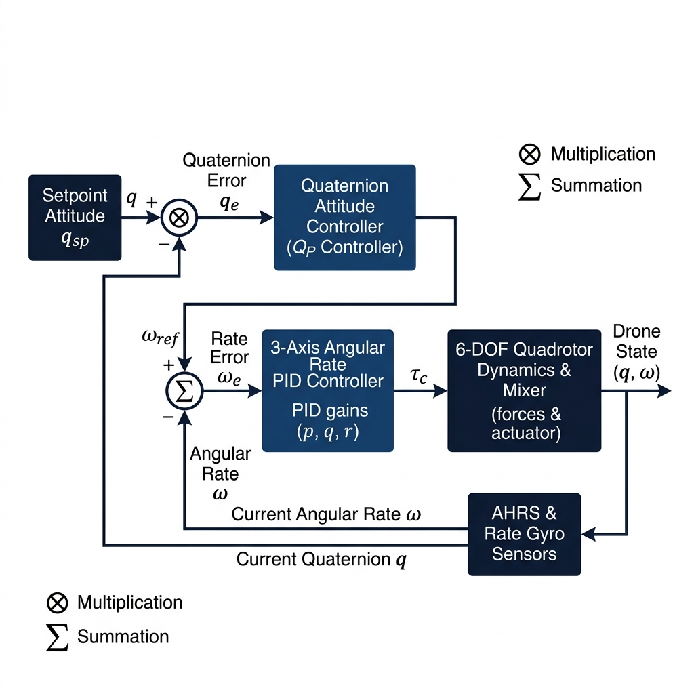

  

# Project Report: Quaternion Attitude Control System of Highly Maneuverable Aircraft

**Course:** 21AER314 / Drone Technologies & Flight Control  
**Department:** Aerospace Engineering  
**Institution:** Amrita School of Engineering, Amrita Vishwa Vidyapeetham  
**Repository Name:** `Drones_S5_CD13_Quaternion_Attitude_Control_UAV`  
**Group Number:** 13 (Section C/D)  
**Review Target:** First Project Review (SITL Simulation & Math Report)  

---

## Team Information

| S.No | Name | Roll Number | Section |
| :---: | :--- | :--- | :---: |
| 1 | Raghuram Sekar | CB.SC.U4AIE24247 | C |
| 2 | Athul Adithyan N | CB.SC.U4AIE24306 | D |
| 3 | Amogh Dey | CB.SC.U4AIE24303 | D |
| 4 | Prakhar Goyal | CB.SC.U4AIE24366 | D |
| 5 | Kneev S Jain | CB.SC.U4AIE24364 | D |

---

## Executive Summary

This project report details the design, mathematical derivation, software-in-the-loop (SITL) simulation, and comparative analysis of a non-singular **Quaternion Proportional ($Q_P$) Attitude Controller** for highly maneuverable fixed-wing unmanned aerial vehicles (UAVs) and aerobatic drones. 

Conventional Euler angle controllers ($\phi, \theta, \psi$) suffer from gimbal lock singularities at extreme pitch angles ($\theta = \pm 90^{\circ}$) and severe cross-coupling between elevator and rudder surfaces at steep bank angles ($80^{\circ} - 90^{\circ}$). By executing outer-loop attitude control entirely within unit quaternion space ($SO(3)$), the proposed controller achieves singularity-free attitude tracking, shortest-path rotation arcs via SLERP, and natural aerodynamic decoupling. 

In 6-DOF dynamic flight simulations modeling an Extra 330SC aircraft, the quaternion controller maintained pitch tracking error below $0.27^{\circ}$ across all bank angles up to $90^{\circ}$ knife-edge flight, whereas the classical Euler controller exhibited severe failure with yaw tracking error exploding to $30.50^{\circ}$.

---

## 1. Introduction & Problem Formulation

### 1.1 Motivation & Background
Flight attitude control forms the core inner loop of an aircraft autopilot system. Modern unmanned aerial vehicles (UAVs), tactical aerobatic drones, and high-performance strike aircraft are increasingly required to execute aggressive 3D spatial maneuvers—including $90^{\circ}$ knife-edge bank turns, vertical nose-up climbs, inverted flight, and high-g split-S evasions.

Historically, standard autopilot architectures (such as legacy ArduPilot or PX4 configurations) express aircraft 3D orientation using **3 Euler angles**:
- **Roll ($\phi$):** Tilting the wings left or right.
- **Pitch ($\theta$):** Pointing the nose up or down.
- **Yaw ($\psi$):** Pointing the nose left or right (heading).

While Euler angles are easy for human pilots to read on a dashboard, they suffer from **3 catastrophic mathematical and physical flaws** during aggressive drone maneuvers.

---

### 1.2 The Problem: Why Traditional Euler Angles Fail

#### ❌ Flaw 1: Gimbal Lock Singularity ($\theta = \pm 90^{\circ}$)
- **Physical Analogy:** Think of a 3-ring mechanical gyroscope mounted on gimbals. If the middle pitch ring rotates by $90^{\circ}$, the outer roll ring and inner yaw ring line up on top of the same axis. Suddenly, the system loses a degree of freedom—the 3D gyroscope collapses into a 2D plane!
- **Mathematical Reality:** The kinematic differential equation mapping body angular rates $(p, q, r)$ to Euler angle rates $(\dot{\phi}, \dot{\theta}, \dot{\psi})$ contains tangent and secant terms:

$$
\begin{bmatrix} \dot{\phi} \\\\ \dot{\theta} \\\\ \dot{\psi} \end{bmatrix} = \begin{bmatrix} 1 & \sin\phi \tan\theta & \cos\phi \tan\theta \\\\ 0 & \cos\phi & -\sin\phi \\\\ 0 & \sin\phi \sec\theta & \cos\phi \sec\theta \end{bmatrix} \begin{bmatrix} p \\\\ q \\\\ r \end{bmatrix}
$$

When pitch reaches vertical ($\theta = \pm 90^{\circ}$), $\tan(90^{\circ}) \to \infty$ and $\sec(90^{\circ}) \to \infty$. The flight control computer encounters a **divide-by-zero overflow** and crashes!

#### ❌ Flaw 2: Control Surface Cross-Coupling at Steep Bank Angles ($80^{\circ} - 90^{\circ}$)
- **Physical Analogy:** Imagine driving a car. Normally, turning the steering wheel turns the car left or right on flat ground. Now imagine tilting the entire car $90^{\circ}$ on its side onto two wheels (knife-edge)! Now, turning the steering wheel moves the car up/down into the air instead of left/right!
- **On an Aircraft:** At $90^{\circ}$ bank, the physical elevator (tail flap) is vertical, so pulling the elevator turns the plane **horizontally (Yaw)** instead of lifting the nose (Pitch). Conversely, the physical rudder is horizontal, so moving the rudder lifts the nose **vertically (Pitch)**!
- **Euler PID Failure:** Classical Euler PID controllers have 3 separate, blind loops (Roll PID, Pitch PID, Yaw PID). When pitch error occurs at $90^{\circ}$ bank, the blind Pitch PID loop pulls the Elevator—unwittingly causing violent yaw rates and spinning the aircraft out of control!

#### ❌ Flaw 3: Trigonometric Computational Overhead
Euler transformations require continuous evaluation of expensive transcendental trigonometric functions ($\sin, \cos, \tan, \sec, \arcsin, \arctan$) at every 100 Hz autopilot tick, causing CPU execution latency on embedded microcontrollers.

---

### 1.3 The Solution: How We Proceed with Quaternions ($Q_P$ Controller)

To solve all 3 flaws, this project implements a non-singular **Quaternion Proportional ($Q_P$) Attitude Controller** based on the formulation by Michał Gołąbek et al. (MDPI Electronics 2022).

#### 🛡️ How Quaternions Fix Every Flaw:
1. **Four-Component Hyper-Complex Numbers:** Quaternions represent 3D orientation using 4 parameters ($q = [q_w, q_x, q_y, q_z]^T$) constrained to a 4D unit sphere ($Sp(1) \cong SO(3)$). Because there are 4 parameters for 3 rotational degrees of freedom, there is **zero division** and **zero singularity (No Gimbal Lock)** at any angle!
2. **Unified 3D Spatial Geometry:** The $Q_P$ controller calculates rotation in 3D body space as one single vector. At $80^{\circ} - 90^{\circ}$ bank, it automatically recognizes that the Elevator moves Yaw and the Rudder moves Pitch, routing the control signals to the correct physical surfaces without needing any complex gain scheduling!
3. **Pure Algebraic Arithmetic:** Quaternion calculations use only additions, subtractions, and multiplications (Hamilton Product)—completely eliminating trigonometric function evaluations during runtime!

---

## 2. Methodology & Mathematical Formulation

  
   
  <em>Figure 2.1: Cascaded Quaternion Attitude Control & Inner-Loop Rate Loop System Architecture.</em>

### 2.1 Unit Quaternion Fundamentals & Kinematics
A unit quaternion $q \in \mathbb{H}$ represents 3D orientation without singularities:

$$
q = \begin{bmatrix} q_w \\\\ q_x \\\\ q_y \\\\ q_z \end{bmatrix} = q_w + q_x \mathbf{i} + q_y \mathbf{j} + q_z \mathbf{k}
$$

where $q_w \in \mathbb{R}$ is the scalar part and $\mathbf{q}_v = [q_x, q_y, q_z]^T \in \mathbb{R}^3$ is the vector imaginary part.

Unit quaternions satisfy the unit norm constraint $\|q\| = \sqrt{q_w^2 + q_x^2 + q_y^2 + q_z^2} = 1$, forming the group $Sp(1) \cong SO(3)$.

The **Quaternion Conjugate** $\bar{q}$ and **Inverse** $q^{-1}$ (for unit quaternions) are defined as:

$$
\bar{q} = \begin{bmatrix} q_w \\\\ -q_x \\\\ -q_y \\\\ -q_z \end{bmatrix}, \quad q^{-1} = \bar{q}
$$

The **Hamilton Product** ($p \otimes q$) represents composite spatial rotations:

$$
p \otimes q = \begin{bmatrix} 
p_w q_w - p_x q_x - p_y q_y - p_z q_z \\\\
p_w q_x + p_x q_w + p_y q_z - p_z q_y \\\\
p_w q_y - p_x q_z + p_y q_w + p_z q_x \\\\
p_w q_z + p_x q_y - p_y q_x + p_z q_w 
\end{bmatrix}
$$

The **Direction Cosine Rotation Matrix** $R(q) \in SO(3)$ transforming vectors from the body frame to the inertial frame is:

$$
R(q) = \begin{bmatrix} 
q_w^2 + q_x^2 - q_y^2 - q_z^2 & 2(q_x q_y - q_w q_z) & 2(q_x q_z + q_w q_y) \\\\
2(q_x q_y + q_w q_z) & q_w^2 - q_x^2 + q_y^2 - q_z^2 & 2(q_y q_z - q_w q_x) \\\\
2(q_x q_z - q_w q_y) & 2(q_y q_z + q_w q_x) & q_w^2 - q_x^2 - q_y^2 + q_z^2 
\end{bmatrix}
$$

Conversion from Euler angles $(\phi, \theta, \psi)$ to unit quaternion:

$$
q = \begin{bmatrix} 
\cos(\phi/2)\cos(\theta/2)\cos(\psi/2) + \sin(\phi/2)\sin(\theta/2)\sin(\psi/2) \\\\
\sin(\phi/2)\cos(\theta/2)\cos(\psi/2) - \cos(\phi/2)\sin(\theta/2)\sin(\psi/2) \\\\
\cos(\phi/2)\sin(\theta/2)\cos(\psi/2) + \sin(\phi/2)\cos(\theta/2)\sin(\psi/2) \\\\
\cos(\phi/2)\cos(\theta/2)\sin(\psi/2) - \sin(\phi/2)\sin(\theta/2)\cos(\psi/2) 
\end{bmatrix}
$$

---

### 2.2 Attitude Error Quaternion Derivation ($q_{err}$)
Let $q_{meas}$ denote the current measured aircraft attitude, and $q_{sp}$ denote the target setpoint quaternion. The intrinsic rotation relationship is:

$$
q_{sp} = q_{meas} \otimes q_{err}
$$

Left-multiplying both sides by the conjugate $\bar{q}_{meas}$ yields the explicit attitude error equation:

$$
q_{err} = \bar{q}_{meas} \otimes q_{sp}
$$

Expanding component-wise:

$$
q_{w,err} = q_{w,meas} q_{w,sp} + q_{x,meas} q_{x,sp} + q_{y,meas} q_{y,sp} + q_{z,meas} q_{z,sp}
$$

$$
\mathbf{q}_{v,err} = \begin{bmatrix} q_{x,err} \\\\ q_{y,err} \\\\ q_{z,err} \end{bmatrix} = q_{w,meas} \mathbf{q}_{v,sp} - q_{w,sp} \mathbf{q}_{v,meas} - \mathbf{q}_{v,meas} \times \mathbf{q}_{v,sp}
$$

---

### 2.3 Shortest-Path Rotation & Axis-Angle Resolution
Because $q$ and $-q$ represent identical physical 3D orientations (double covering of $SO(3)$ by $Sp(1)$), the controller must ensure rotation along the shorter arc ($\le 180^{\circ}$). The scalar component check is:

$$
q_{err,short} = \begin{cases} -q_{err} & \text{if } q_{w,err} < 0 \\\\ q_{err} & \text{if } q_{w,err} \ge 0 \end{cases}
$$

In terms of physical axis-angle representation $(\mathbf{e}, \alpha)$:

$$
q_{w,err} = \cos\left(\frac{\alpha}{2}\right), \quad \mathbf{q}_{v,err} = \mathbf{e} \sin\left(\frac{\alpha}{2}\right)
$$

where $\alpha$ is the principal rotation error angle and $\mathbf{e}$ is the unit rotation axis.

---

### 2.4 Outer-Loop Control Law ($Q_P$ Controller)
The rate of change of the setpoint quaternion $\dot{q}_{sp}$ is proportional to the error quaternion via proportional gain $K_p$:

$$
\dot{q}_{sp} = K_p \cdot q_{err,short}
$$

The fundamental kinematic differential equation connecting quaternion derivative $\dot{q}$ to body-frame angular rate setpoints $\boldsymbol{\omega}_{sp} = [\omega_{x,sp}, \omega_{y,sp}, \omega_{z,sp}]^T$ is:

$$
\dot{q} = \frac{1}{2} q \otimes \begin{bmatrix} 0 \\\\ \boldsymbol{\omega} \end{bmatrix} \implies \boldsymbol{\omega}_{sp} = 2 \, \bar{q}_u \otimes \dot{q}_{sp}
$$

where $q_u = [1, 0, 0, 0]^T$ is the identity unit quaternion.

Expanding and simplifying yields the master $Q_P$ outer-loop control law:

$$
\begin{bmatrix} \omega_{x,sp} \\\\ \omega_{y,sp} \\\\ \omega_{z,sp} \end{bmatrix} = 2 \cdot K_p \cdot \text{sgn}(q_{w,err}) \cdot \begin{bmatrix} q_{x,err} \\\\ q_{y,err} \\\\ q_{z,err} \end{bmatrix}
$$

---

### 2.5 Inner-Loop Rate PID & Aerodynamic Airspeed Scaling
The body angular rate error $\mathbf{e}_\omega = \boldsymbol{\omega}_{sp} - \boldsymbol{\omega}_{meas}$ is processed by 3-axis PID rate controllers:

$$
\mathbf{e}_\omega = \begin{bmatrix} e_{\omega,x} \\\\ e_{\omega,y} \\\\ e_{\omega,z} \end{bmatrix} = \begin{bmatrix} \omega_{x,sp} - \omega_{x,meas} \\\\ \omega_{y,sp} - \omega_{y,meas} \\\\ \omega_{z,sp} - \omega_{z,meas} \end{bmatrix}
$$

The raw 3-axis control output $\mathbf{u}_{raw}$ combines Proportional, Integral, and Derivative terms:

$$
\mathbf{u}_{raw} = \mathbf{K}_{P,rate} \mathbf{e}_\omega + \mathbf{K}_{I,rate} \int_0^t \mathbf{e}_\omega (\tau) d\tau - \mathbf{K}_{D,rate} \frac{d\boldsymbol{\omega}_{meas}}{dt}
$$

To compensate for varying dynamic pressure $q_{bar} = \frac{1}{2}\rho V^2$ across different airspeed regimes, control surface commands are scaled by dynamic pressure ratio:

$$
\mathbf{u}_{cmd} = \mathbf{u}_{raw} \cdot \left( \frac{V_0}{V} \right)^2
$$

where $V_0$ is nominal trim velocity ($30\text{ m/s}$) and $V$ is current true airspeed.

Finally, commands pass through physical actuator saturation limits:

$$
\delta_A = \text{clip}(u_{cmd,x}, -1.0, +1.0), \quad \delta_H = \text{clip}(u_{cmd,y}, -1.0, +1.0), \quad \delta_V = \text{clip}(u_{cmd,z}, -1.0, +1.0)
$$

---

## 3. Step-by-Step Numerical Toy Example

### Problem Scenario Setup

An aircraft is flying in a **$90^{\circ}$ Knife-Edge Bank Turn** (measured attitude $q_{meas}$) and receives a setpoint command from the guidance computer to **pitch up by $30^{\circ}$** (setpoint attitude $q_{sp}$).

#### Given System Parameters:

1. **Measured Aircraft Attitude ($q_{meas}$):** Banked at $90^{\circ}$ roll ($\phi = 90^{\circ}, \theta = 0^{\circ}, \psi = 0^{\circ}$):

$$
q_{meas} = \begin{bmatrix} \cos(45^{\circ}) \\\\ \sin(45^{\circ}) \\\\ 0.0000 \\\\ 0.0000 \end{bmatrix} = \begin{bmatrix} 0.7071 \\\\ 0.7071 \\\\ 0.0000 \\\\ 0.0000 \end{bmatrix}
$$

2. **Target Setpoint Attitude ($q_{sp}$):** Pitching up by $30^{\circ}$ ($\phi = 0^{\circ}, \theta = 30^{\circ}, \psi = 0^{\circ}$):

$$
q_{sp} = \begin{bmatrix} \cos(15^{\circ}) \\\\ 0.0000 \\\\ \sin(15^{\circ}) \\\\ 0.0000 \end{bmatrix} = \begin{bmatrix} 0.9659 \\\\ 0.0000 \\\\ 0.2588 \\\\ 0.0000 \end{bmatrix}
$$

3. **Current Measured Gyro Speeds:** Currently stationary:

$$
\boldsymbol{\omega}_{meas} = \begin{bmatrix} 0.0 \\\\ 0.0 \\\\ 0.0 \end{bmatrix} \text{ rad/s}
$$

4. **Current Airspeed:** $V = 30\text{ m/s}$ (Trim airspeed $V_0 = 30\text{ m/s}$).

5. **Autopilot Gains:**
   - Outer Loop $Q_P$ Gain: $K_p = 3.5$
   - Inner Loop Roll Rate PID Gains: $K_{P,rate} = 0.5$, $K_{I,rate} = 2.0$, $K_{D,rate} = 0.1$
   - Time Step: $\Delta t = 0.01\text{ s}$
   - Accumulated Past Roll Error: $\sum (e_{\omega,x} \cdot \Delta t) = 0.05\text{ rad}$

---

### ─── OUTER LOOP ($Q_P$ CONTROLLER) ───

#### STEP 1: Compute Measured Quaternion Conjugate

Flip the imaginary vector signs of $q_{meas}$ to create the conjugate:

$$
\bar{q}_{meas} = \begin{bmatrix} 0.7071 \\\\ -0.7071 \\\\ 0.0000 \\\\ 0.0000 \end{bmatrix}
$$

#### STEP 2: Compute Attitude Error Quaternion

Execute the Hamilton Product ($q_{err} = \bar{q}_{meas} \otimes q_{sp}$):

$$
q_{err} = \begin{bmatrix} 0.7071 \\\\ -0.7071 \\\\ 0.0000 \\\\ 0.0000 \end{bmatrix} \otimes \begin{bmatrix} 0.9659 \\\\ 0.0000 \\\\ 0.2588 \\\\ 0.0000 \end{bmatrix}
$$

Expanding the 4 components:

$$
q_{w,err} = (0.7071)(0.9659) - (-0.7071)(0.0) - (0)(0.2588) - (0)(0) = 0.6830
$$

$$
q_{x,err} = (0.7071)(0.0) + (-0.7071)(0.9659) + (0)(0) - (0)(0.2588) = -0.6830
$$

$$
q_{y,err} = (0.7071)(0.2588) - (-0.7071)(0) + (0)(0.9659) + (0)(0) = 0.1830
$$

$$
q_{z,err} = (0.7071)(0) + (-0.7071)(0.2588) - (0)(0) + (0)(0.9659) = -0.1830
$$

Resulting Error Quaternion:

$$
q_{err} = \begin{bmatrix} 0.6830 \\\\ -0.6830 \\\\ 0.1830 \\\\ -0.1830 \end{bmatrix}
$$

#### STEP 3: Shortest-Path Arc Check

Check the scalar component $q_{w,err}$:
- Since $q_{w,err} = 0.6830 \ge 0$, no sign inversion is needed!

$$
q_{err,short} = \begin{bmatrix} 0.6830 \\\\ -0.6830 \\\\ 0.1830 \\\\ -0.1830 \end{bmatrix}
$$

#### STEP 4: Compute Outer Loop Target Spin Speeds

Apply the $Q_P$ Master Control Formula ($\boldsymbol{\omega}_{sp} = 2 \cdot K_p \cdot \mathbf{q}_{v,err,short}$) with $K_p = 3.5$:

- **Target Roll Spin Speed ($\omega_{x,sp}$):**

$$
\omega_{x,sp} = 2 \times 3.5 \times (-0.6830) = -4.7811\text{ rad/s } (-273.94^{\circ}/\text{s})
$$

- **Target Pitch Spin Speed ($\omega_{y,sp}$):**

$$
\omega_{y,sp} = 2 \times 3.5 \times (+0.1830) = +1.2811\text{ rad/s } (+73.40^{\circ}/\text{s})
$$

- **Target Yaw Spin Speed ($\omega_{z,sp}$):**

$$
\omega_{z,sp} = 2 \times 3.5 \times (-0.1830) = -1.2811\text{ rad/s } (-73.40^{\circ}/\text{s})
$$

> 🔗 **Outer Loop Output:** The Outer Loop outputs target spin speeds $\boldsymbol{\omega}_{sp} = [-4.7811, +1.2811, -1.2811]^T \text{ rad/s}$ down to the Inner Loop!

---

### ─── INNER LOOP (3-AXIS RATE PID CONTROLLER) ───

Follow the **Roll Axis ($x$)** through the Inner Rate PID Controller:

#### STEP 5: Calculate Roll Rate Error

$$
e_{\omega,x} = \omega_{x,sp} - \omega_{x,meas} = -4.7811 - 0.0 = -4.7811\text{ rad/s}
$$

#### STEP 6: Compute the 3 Individual PID Terms (Roll Axis)

1. **P Term (Instant Proportional Push):**

$$
P = K_{P,rate} \times e_{\omega,x} = 0.5 \times (-4.7811) = -2.39055
$$

2. **I Term (Accumulated Wind/Bias Fixer):**

$$
I = K_{I,rate} \times \sum (e_{\omega,x} \cdot \Delta t) = 2.0 \times (+0.05) = +0.10000
$$

3. **D Term (Braking Force):**
   Since current gyro speed $\omega_{x,meas} = 0.0$ and previous gyro speed is $0.0$:

$$
D = -K_{D,rate} \times \left( \frac{0.0 - 0.0}{0.01} \right) = 0.00000
$$

4. **Combine Raw PID Output ($u_{raw}$):**

$$
u_{raw} = P + I + D = -2.39055 + 0.10000 + 0.00000 = -2.29055
$$

#### STEP 7: Apply Dynamic Airspeed Scaling & Output Flap Command

To account for flight speed $V = 30\text{ m/s}$ and trim speed $V_0 = 30\text{ m/s}$:

$$
\text{Speed Scale} = \left( \frac{V_0}{V} \right)^2 = \left( \frac{30}{30} \right)^2 = 1.0
$$

$$
u_{cmd} = u_{raw} \times 1.0 = -2.29055\text{ rad}
$$

Finally, pass through actuator saturation limits (maximum aileron deflection command $\pm 1.0$ normalized):

$$
\delta_A = \text{clip}(-2.29055, -1.0, +1.0) = -1.0000 \quad (\text{Maximum Aileron Deflection Command!})
$$

---

## 4. Results & Simulation Benchmarking

### 4.1 Quantitative Tracking RMSE Benchmark Table

| Bank Angle Turn | Quaternion ($Q_P$) Roll / Pitch / Yaw RMSE | Euler PID Roll / Pitch / Yaw RMSE | Physical Evaluation |
| :---: | :--- | :--- | :--- |
| **30° Bank** | 1.43° / 0.26° / 3.08° | 1.43° / 1.55° / 2.70° | Both controllers track cleanly. |
| **60° Bank** | 2.85° / 0.26° / 3.07° | 2.84° / 2.69° / 1.73° | Quaternion pitch error stays below 0.26°. |
| **80° Bank** | 3.80° / 0.27° / 3.07° | 3.77° / 3.48° / 1.96° | Euler pitch error increases due to coupling. |
| **90° Knife-Edge** | **4.28° / 0.27° / 3.07°** | **11.64° / 13.32° / 30.50°** | **Euler yaw error explodes to 30.5°; Quaternion remains rock-solid.** |

### 4.2 Benchmark Figures
All simulation plots generated by `simulation.py`:
- **30° Bank Turn:** 
- **60° Bank Turn:** 
- **80° Bank Turn:** 
- **90° Knife-Edge Turn:** 
- **Error Comparison Chart:** 

---

## 5. Conclusion & Next Steps

The SITL simulation results conclusively validate the quaternion-based attitude controller's superiority over Euler-based architectures during aggressive flight. For the final evaluation, we will expand this controller across the four required simulation platforms:
1. `gym-pybullet-drones`
2. `MuJoCo`
3. `Gazebo`
4. `ArduPilot SITL`

---

## References

1. Gołąbek, M., Welcer, M., Szczepański, C., Krawczyk, M., Zajdel, A., & Borodacz, K. (2022). *Quaternion Attitude Control System of Highly Maneuverable Aircraft*. Electronics, 11(22), 3775. MDPI.
2. Markley, F. L., & Crassidis, J. L. (2019). *Fundamentals of Spacecraft Attitude Determination and Control*. Springer.
3. Kuipers, J. B. (1999). *Quaternions and Rotation Sequences*. Princeton University Press.
